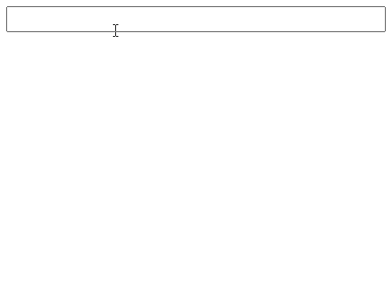

# Input autocomplete suggestions
## ReactJS component library

## Description
- A npm library for ReactJS that autocompletes user's search inputs.
- Lightweight library with no additional dependencies.
- Hightly customizeable with parameters and personal styling
- Use cases tested

## Installation
### npm
#### Install
`npm i input-autocomplete-suggestions-reactjs --save`
#### Import 
`import CustomInput from 'input-autocomplete-suggestions-reactjs'`

or

`import { CustomAutocompleteInput } from 'input-autocomplete-suggestions-reactjs'`
#### Usage
```
const arr = [ "suggestion", "suggestion2", "suggestion3" ];

<CustomAutocompleteInput 
    suggestions={arr}
    placeholderValue="setYourOwnPlaceholder"
    exactMatch={false} 
/>
```

## Parameteres
|    Parameter   | Type     | Mandatory  |    Default   |
|:--------------:|:--------:|:----------:|:------------:|
|  suggestions   | _string[]_    |     ✅     |              |                
| placeholderValue | _string_    |     ❌     |       ""      |     
|   exactMatch    | _boolean_ |     ❌     |      true     |  
| customClassName | _string_ |     ❌     |     ""     | 

### Options
- **Suggestions** is an array of strings that will be presented to user as he types
- **placeholderValue** is non-mandatory parameter thta allow to set input's placeholder value
- **exactMatch**
    * _true_ Input's suggestion will be shown only on exact match ('sug' will trigger 'suggestion' however not 'ish' will not trigger 'fish')
    * _false_ Will show any matches ('sug' will trigger 'suggestion' and 'ish' will also trigger 'fish')
- **customClassName** For better styling a dev can add custom classes (one string cotaning names of all classes, separated with a space)

## Demo


## Links
- *GitHub* [link](https://github.com/bunatl/custom-autocomplete-input/)
- *GitHub issues* [link](https://github.com/bunatl/custom-autocomplete-input/#issues)
- *npm* [link](https://www.npmjs.com/package/input-autocomplete-suggestions-reactjs)

## Contributions
All suggestions and ideas are welcome!

## License
MIT